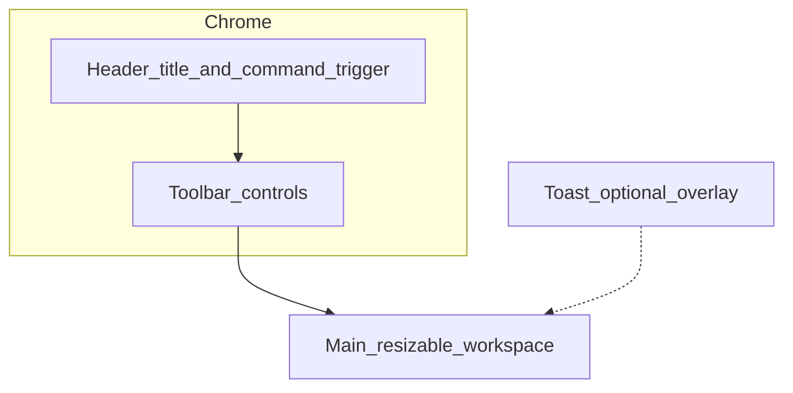

# DSA Visualizer: Current UI Design Draft (Concept Level)

## 1. Product Context and Language

- **Use case**: classroom projection tool for teaching demonstrations; UI language is **English**.
- **Visual tone**: dark, low-glare, IDE-like layout with a workspace and top bars for long viewing sessions and readability at distance.

---

## 2. Global Information Architecture (Top to Bottom)

The page is split into three fixed vertical layers inside the viewport. The intent is **no full-page scroll** (panel internals may scroll):

1. **App header**: product title and a global command entry.
2. **Toolbar**: transport controls, speed controls, and panel visibility toggles.
3. **Main workspace**: resizable columns for code, console, animation, variables, and optional PDF panel.

A separate **toast layer** appears near the bottom center, above main content, and can be dismissed by click or keyboard.

---

## 3. Color System (Dark Green Theme)

The theme is dark teal-green, separating structure bars from content surfaces:

| Role | Purpose | Current token |
|------|---------|---------------|
| Main background / panel content | Reading area and panel bodies | `#031417` |
| Header, toolbar, panel title bars | Structural shell with stronger depth | `#021012` |
| Dividers and weak borders | Region separation and control edges | `#0d2e2c` |
| Primary text | Body text and labels | `#e2f0ed` |
| Secondary text | Captions and placeholders | `#7a9e98` |
| Accent | Primary actions, focus rings, active highlights | `#2dd4bf` / `#14b8a6` |
| Danger (reserved) | Warning and error messages | `#f87171` |

For bar-based algorithm visuals, default bars use muted dark green, comparison bars use teal accents, and the key current element uses yellow-green.

---

## 4. Typography

- **UI copy**: sans-serif system stack.
- **Code, console, variable values**: monospace stack; console and variable zones can use slightly larger text for projection readability.
- **Panel title bars**: compact uppercase style with wider letter spacing.

---

## 5. Header

- Left side: app title.
- Right side: command entry styled like a narrow search strip with a leading magnifier icon (without inline shortcut text).
- Global command panel toggle: **Ctrl+Shift+P** / **Cmd+Shift+P**.
- Shortcuts help: open with top-right Help icon or the **`?`** key.
- Header command area and settings icon should not use hover tooltips in this layout; rely on `aria-label`.

---

## 6. Toolbar

- Multi-row wrapping is allowed on narrower layouts.
- Three logical groups (left to right), separated by vertical dividers:
  1. **Transport**: play/pause, step, reset (icon-only).
  2. **Speed**: `Speed` label plus a discrete slider. Visual chevrons represent slow to fast as decoration only (`aria-hidden`).
  3. **Panel visibility**: segmented chips for Code, Console, Animation, Variables, and PDF.
- Transport buttons and nearby icon-only controls avoid tooltip overlays to prevent occluding labels below.

---

## 7. Main Workspace and Resizable Layout

- The main area has internal padding around panel cards.
- Left column typically holds **Code** above **Console**.
- Right column holds any combination of **Animation**, **Variables**, and **PDF**.
- Default left-right split is approximately narrow-left and wide-right.
- If all panels are closed, show a centered English empty-state hint.

---

## 8. Shared Panel Pattern

Each panel uses a consistent card structure:

- Title bar with an English panel name.
- Content area with internal scroll when needed.
- Resizable behavior built on `react-resizable-panels`.
- Conditional rendering must use stable `id` and `order` for each `Panel`, and predictable IDs for `PanelGroup` and `PanelResizeHandle`, to avoid split-direction mismatch or stale size allocation.

---

## 9. Panel Content Notes (Visual and Information)

- **Code panel**:
  - Uses **Monaco Editor** with a dark green custom theme.
  - Current step line uses translucent accent highlight.
  - Symbol category consistency follows semantic highlighting in [`src/monaco/cpptoolsPythonTheme.ts`](../src/monaco/cpptoolsPythonTheme.ts).
- **Console panel**:
  - Monospace output stream; gray empty-state hint when no output exists.
- **Animation panel**:
  - Contains a one-line step description and icon-only controls.
  - In shortcuts help, autoplay toggle is represented as dual state icons (`Play` + `Pause`) with the `Space` key.
  - Presentation shortcuts mirror UI help: Next step supports `Enter` / `→` / `Left click`; Previous step supports `←` / `Right click`.
  - Text in the animation area should not be user-selectable.
  - Sorting visuals use bar heights proportional to values.
  - Overlaid pointers (`i`, `j`, `j-1`, `min`) share horizontal transition timing with bar FLIP movement and support first-appearance enter animation.
  - On rapid step changes, pointer re-entry must clear stale exit styles to avoid invisible-but-mounted race conditions.
  - `min` must not occupy bar-layout slots, to prevent fit jitter.
  - `Stack (linked list)` visualization uses left-to-right square nodes with `first` at the left; show `first/oldfirst` pointers only.
  - Array index labels are hidden for stack algorithms.
  - Pointer stacking rule: keep a stable baseline when pointers target different nodes; stack upward only when targeting the same node.
  - Settings include internal scroll mode and fit-to-viewport mode with stable trace-based sizing.
  - English UI strings are sourced from `strings.ts`.
- **Variables panel**:
  - Two-column table: variable name and rendered value string.
- **PDF panel**:
  - Placeholder for future embedded reader support.

---

## 10. Global Feedback and Accessibility

- **Toast**:
  - For short status feedback (for example, code changed and trace may be out of sync).
  - Supports auto-dismiss and manual close.
  - In mismatch cases, include a **Reset demo** action.
- **Icon-only controls**:
  - Must provide clear `aria-label`.
  - Do not depend on native `title`.
- **Speed slider**:
  - Visible chevrons are metaphor only.
  - Screen reader output uses `aria-valuetext` with speed label and per-step milliseconds.
- **Reduced motion**:
  - Under `prefers-reduced-motion: reduce`, replace strong animated cues with near-static alternatives.
- **Panel chips**:
  - Must expose pressed state to assistive tech.
  - If Animation auto-collapses due to viewport limits, its chip appears dimmed and announces the reason via extended `aria-label`.
- **Animation minimum visible area**:
  - Single source of truth is [`src/lib/animationViewportMin.ts`](../src/lib/animationViewportMin.ts).
  - During drag, auto-close is deferred until pointer release if still below threshold.
  - Splitter behavior near threshold should feel magnet-like and consistent with dynamic `minSize` handling in `react-resizable-panels`.

---

## 11. Design Intention Summary

- Layering strategy: `#021012` for shell/title bars, `#031417` for content surfaces.
- Reading flow: identify app in header, control pace in toolbar, read code/logs on left, view animation/variables on right.
- Toolbar rhythm: transport on left, speed in middle, visibility controls on right.
- Visual continuity: code editor and surrounding panels share one dark-green token system.
- Reserved extension points: command entry and PDF panel.

---

*This document describes UI concept and interaction constraints only; it does not define data models, state machine details, or file structure.*
